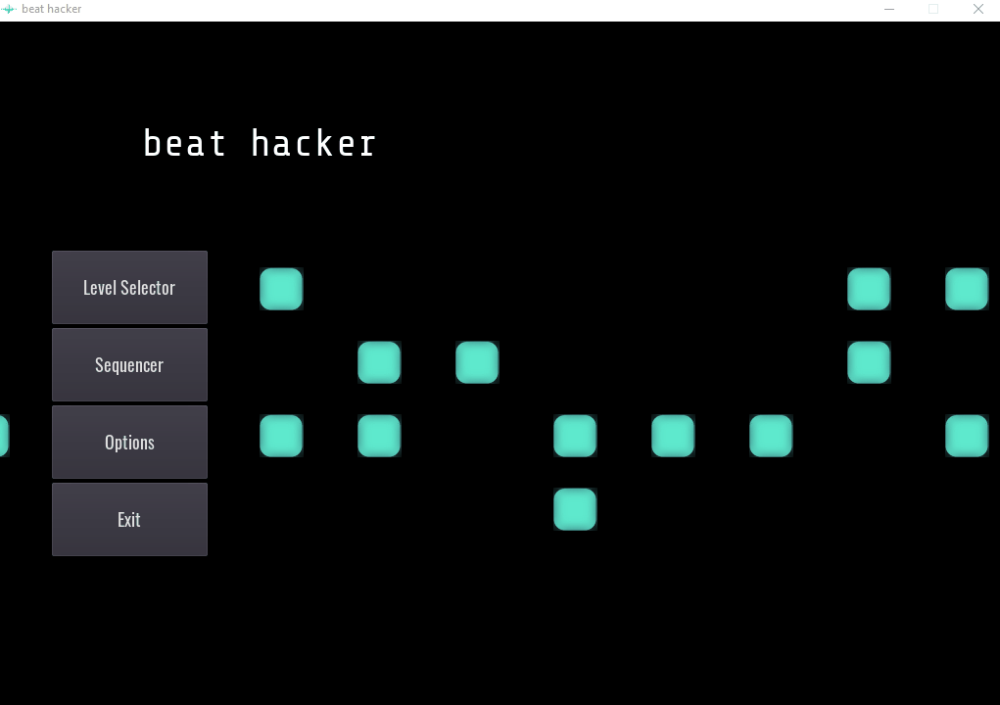

# beat hacker

Beat hacker is a rhythm simulation game designed to teach people how 
to program beats digitally. It features a simple beat sequencer, similar
to what you would see in modern digital audio workstations(DAWs) that can
be toyed with freely to learn how to use the sequencer. The game aspect
happens when the user chooses a level to play, and a beat gets played back to
them.  The goal as the user is to recreate the beat they hear in the sequencer, ultimately training the user how to become a better digital
drummer.

Godot Engine is used to develop `beat hacker`. You can easily run and edit the project by
cloning the repo and then using the latest Godot Engine build for your system to open 
the project file or run the game.

If you are interested in further development of this project and would
like to contribute, or have any feedback regarding the project, feel free to
reach out to me via e-mail masondructor at gmail dot com.

<a href="http://beathacker.rocks" target="_blank">CHECK OUT AN OUTDATED HTML5 BUILD LIVE HERE.</a>